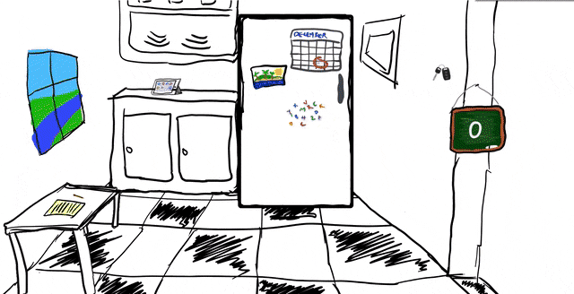

# Ref

A full-stack refrigerator simulation game.

## Technologies

- React
- Express
- Nodejs
- PostgreSQL

## Installation

Install [PostgreSQL](https://www.postgresql.org/download/)

```
git clone https://github.com/kimhonrada/Ref

cd Ref

npm install
```

## Feature

The fridge stocks new, random food, based from the database, everytime the door is closed



User can add food to the database using a custom modal. User can include the name, and the image url of the food. Image upload will be supported on future updates


Included a minigame where a user can guess what is inside the fridge and earn points. Added a simple login feature, to retrieve current points base on username


